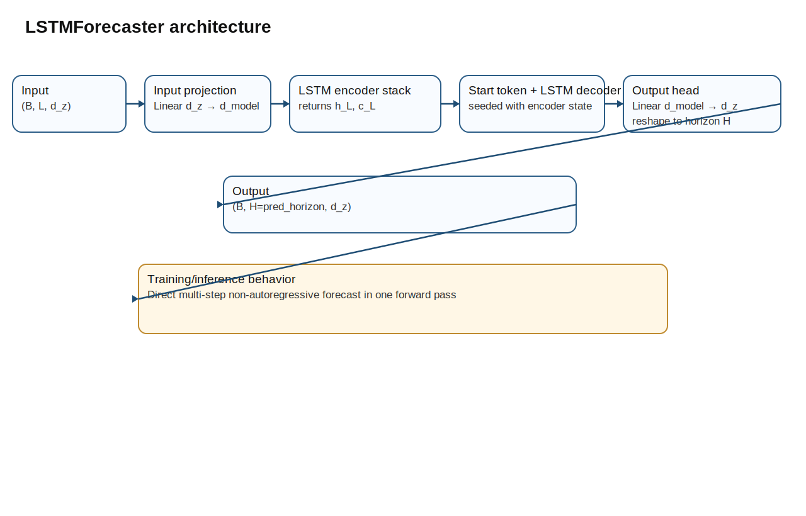
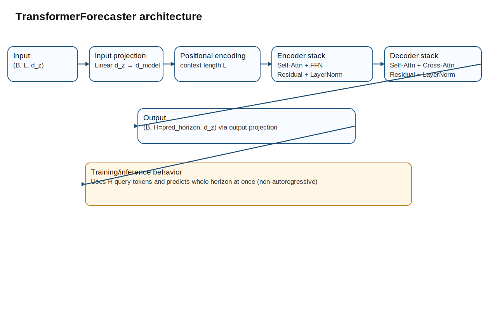
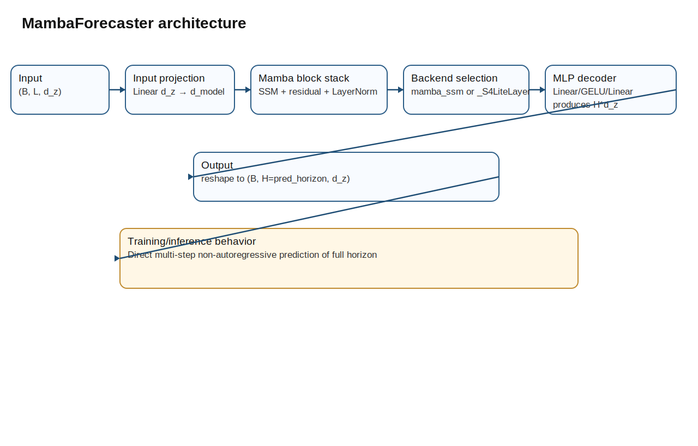

# Forecasting Architecture Diagrams

The following diagrams summarize the three forecasters in `notebooks/fuckeverythingthisislatest-externalfileedition.ipynb`.

## LSTMForecaster

- Input latent context uses shape **(B, L, d_z)**.
- Input projection maps latent tokens into model dimension `d_model`.
- Encoder LSTM produces final hidden/cell state used to initialize decoder dynamics.
- Decoder uses a learned start token and outputs the full horizon after output projection.
- Final tensor is reshaped as **(B, H, d_z)** where `H = pred_horizon`.
- Training and inference both use direct non-autoregressive multi-step output.

## TransformerForecaster

- Input and positional encoding produce context embeddings with temporal order.
- Transformer encoder stack models context with self-attention + FFN + residual/LayerNorm.
- Decoder operates on horizon query tokens and attends to encoder memory via cross-attention.
- Output projection maps decoder states back to latent variable dimension `d_z`.
- Output shape is **(B, H, d_z)** for full-horizon prediction in one pass.

## MambaForecaster

- Input projection maps latent vectors from `d_z` to `d_model`.
- A stack of Mamba blocks models sequence dynamics with residual pathways and LayerNorm.
- Backend uses `mamba_ssm` when available; otherwise falls back to `_S4LiteLayer`.
- MLP decoder maps final representation to `H * d_z` and reshapes to horizon output.
- In both training and inference, prediction is direct non-autoregressive multi-step output.
