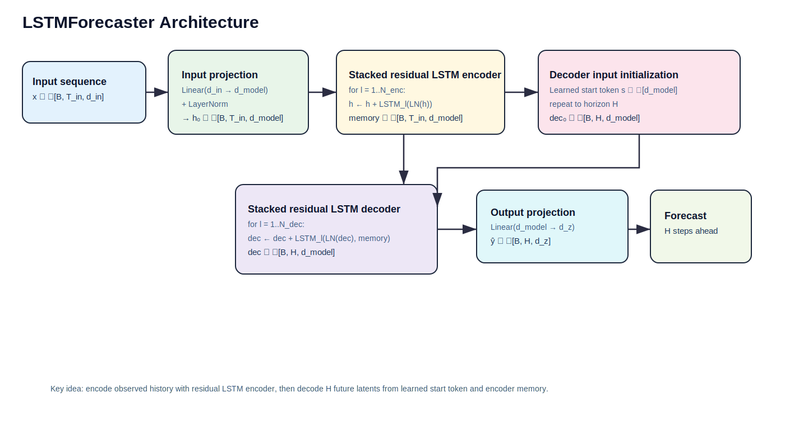
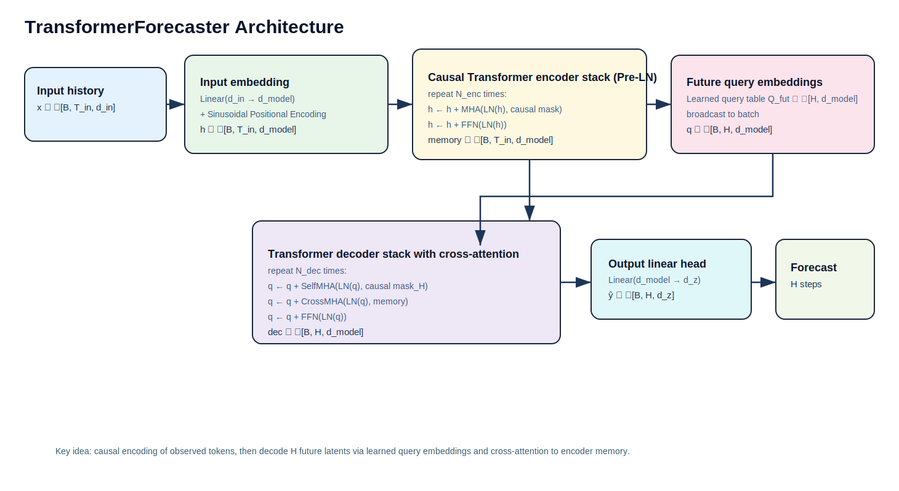
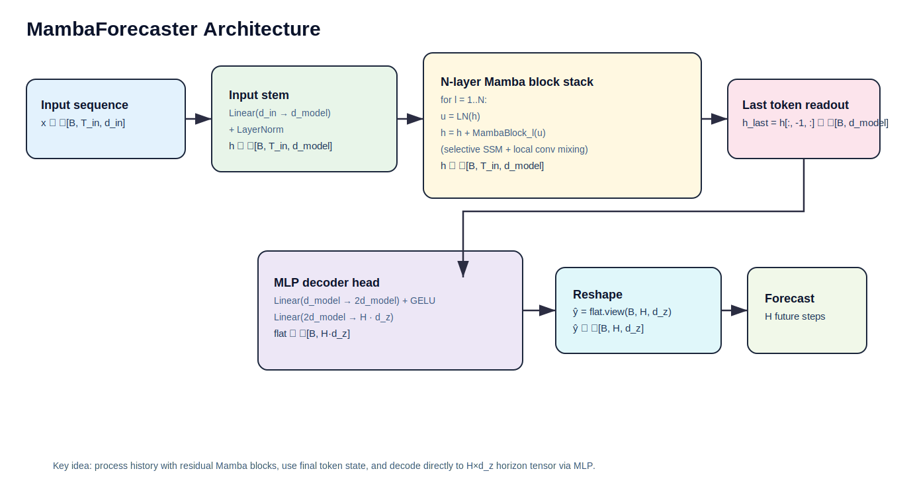

# Forecasting Architectures

This document summarizes the three forecasting model architectures in
`notebooks/fuckeverythingthisislatest-externalfileedition.ipynb` and provides
presentation-ready diagrams.

## 1) `LSTMForecaster`

- Input sequence is projected to model width and normalized.
- A stacked residual LSTM encoder processes observed history.
- Decoder is initialized from a learned start token and runs for horizon `H`.
- A stacked residual LSTM decoder produces future hidden states.
- Final linear projection maps decoder states to latent target dimension `d_z`.

## 2) `TransformerForecaster`

- Input is linearly embedded and augmented with sinusoidal positional encoding.
- A causal Pre-LN Transformer encoder stack builds memory over observed history.
- Learned future query embeddings of length `H` seed decoding.
- Decoder stack performs self-attention + cross-attention to encoder memory.
- Output linear head maps decoder states to `d_z` for each future step.

## 3) `MambaForecaster`

- Input is projected and normalized.
- Sequence is processed by an `N`-layer residual Mamba stack with LayerNorm.
- Last-token representation is extracted as sequence summary.
- An MLP decoder maps summary to flattened `(H × d_z)` output.
- Output is reshaped to `(B, H, d_z)`.

